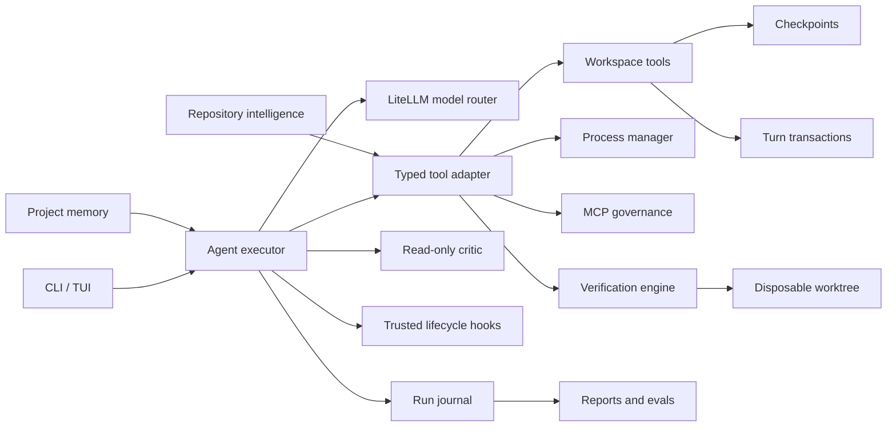

# Agent runtime

Apsara's runtime is deliberately local-first. The model proposes actions, but
the CLI owns permissions, execution, recovery, and durable state.



## Run lifecycle

Every user turn receives an `AgentRun` with `planning`, `executing`,
`verifying`, and terminal states. Its current snapshot is written to
`.apsara/runs/<run-id>/state.json`; append-only events go to `events.jsonl`.
The JSON event interface now distinguishes `completed_verified` (passing current
checks and required review), `completed_unverified` (no usable verifier), and
`completed` (no workspace changes). Event consumers should handle these states.
One-shot commands return 0 for verified/no-change completion, 2 for unverified
completion, and 1 for blocked or failed turns. Run reports include structured
command evidence, critic findings, and the reason for completion or refusal.

Tool strings are adapted into `ToolResult` at the runtime boundary. This keeps
existing local plugins compatible while giving the executor a typed success,
error, and metadata contract.

## Safety and recovery

- All built-in paths resolve beneath the selected workspace.
- Writes remain approval-gated and create a checkpoint before mutation.
- `/undo` restores the latest snapshot, including removing a newly created file.
- `/undo-turn` restores all captured mutations from a completed or interrupted
  agent turn whose current contents match the recorded final state. Later user
  edits, recreated/deleted files, and unrelated new files are preserved. Legacy
  or active manifests without a recorded final state require forced restoration.
  `/undo-turn [id] --force` overwrites conflicts only after explicit approval;
  blanket approval does not cover it. Non-empty directories remain conflicts.
- `/diff` shows the repository's staged, unstaged, and untracked state without
  mutating Git.
- Shell and background commands share the same allowlist validation.
- Background output is bounded and processes are terminated when Apsara exits.
- MCP `readOnlyHint` annotations are honored. Without an annotation, conservative
  name classification is used; external mutation-like calls need approval and
  are blocked by `--read-only`.
- Workspace plugin code and its optional manifest share a trust digest, so
  changing either invalidates prior approval.

## Reliability

Before the first file mutation or command tool, the executor requires a baseline
`verify_project` attempt. Only a passing full structured verification satisfies
the completion gate; unrelated successful shell commands do not. Multi-file
changes and destructive or indirectly observed mutations require an approved
read-only critic review after verification. Critic findings block completion,
including findings from optional single-file reviews. An unavailable or empty
required review blocks completion. Content fingerprints invalidate verification
and approval after any later workspace edit. Checks that change source files or
completion hooks that modify the workspace cannot produce verified completion.
Dependency, build, Git, and Apsara state directories are excluded from these
fingerprints; checks still determine whether the configured project tests pass.
Repeated
identical actions and failed calls
are detected and redirected before the step budget is exhausted. Set
`APSARA_FALLBACK_MODELS` to a comma-separated model chain for failures that
occur before response output begins.

An empty provider response is retried twice with explicit continuation context.
If all three attempts are empty, the run ends as `failed`; empty output is never
reported as a completed turn.

Each streaming model request has a 180-second total deadline and is retried once
when it times out before producing visible output. Auxiliary non-streaming calls
use the same deadline and return an explicit timeout error. Advanced users may
set `APSARA_LLM_CALL_TIMEOUT` in the shell; values are clamped to 30–600 seconds.

Cancellation terminates foreground command, verifier, and hook process groups
before finalizing the `cancelled` checkpoint. On POSIX, timeout cleanup also
handles a child holding output pipes after its parent exits. Long-running work should use
the managed background-process tools so output can be inspected and the process
can be stopped independently. In the TUI, `Ctrl+C` cancels the active agent turn
and preserves the application, current request, observed tool results, and
automatic checkpoints. Resume removes unresolved tool dispatches while keeping
completed exchanges and observed results as context.

## Model compatibility

`apsara doctor` reports registry or LiteLLM metadata for tools, streaming,
context, and output limits. `apsara doctor --live` sends a bounded streamed tool
call probe and validates its arguments without executing any tool. Unknown
capabilities remain unconfirmed; known unsupported capabilities fail before a
provider request. Provider mismatch and context errors receive explicit guidance.

Trusted overrides live in `~/.apsara/models.json`, keyed by the canonical model
ID. `APSARA_MODEL_CAPABILITIES` may point to another user-owned file; project
configuration cannot change it. Example:

```json
{
  "openai/my-compatible-model": {
    "tools": true,
    "streaming": true,
    "context_window": 32768,
    "max_output_tokens": 4096
  }
}
```

Context budgets reserve output space even for small models. Invalid profiles are
rejected, and output requests are capped by the actual configured model limits.

## Extensibility and evaluation

Repository maps and symbol search cover common Python, JavaScript/TypeScript,
Go, Rust, Java, Ruby, PHP, C#, and C/C++ definitions without a heavyweight
index. Persistent user-maintained context lives in `.apsara/memory.md`.

Installed language servers add an on-demand type-aware tier for definitions and
references. The existing AST, Tree-sitter, and text contracts remain the
dependency-free fallback.

`apsara eval` scores recorded traces deterministically. This separates runtime
regression checks from paid, nondeterministic model calls and makes tool-use
expectations suitable for CI.
